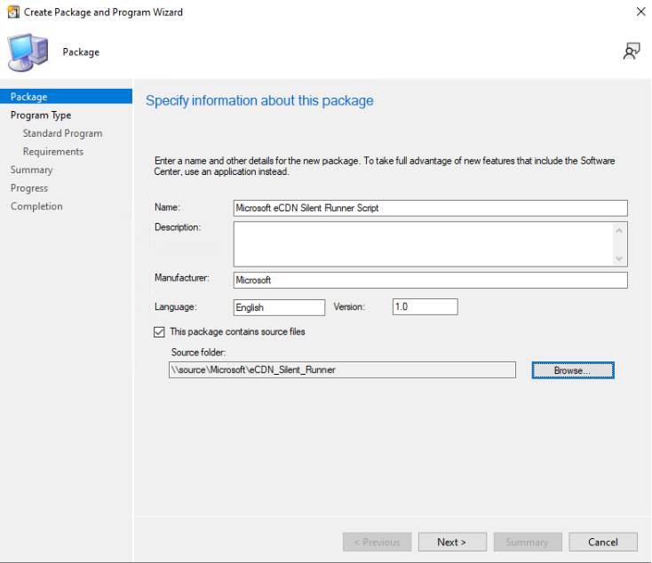
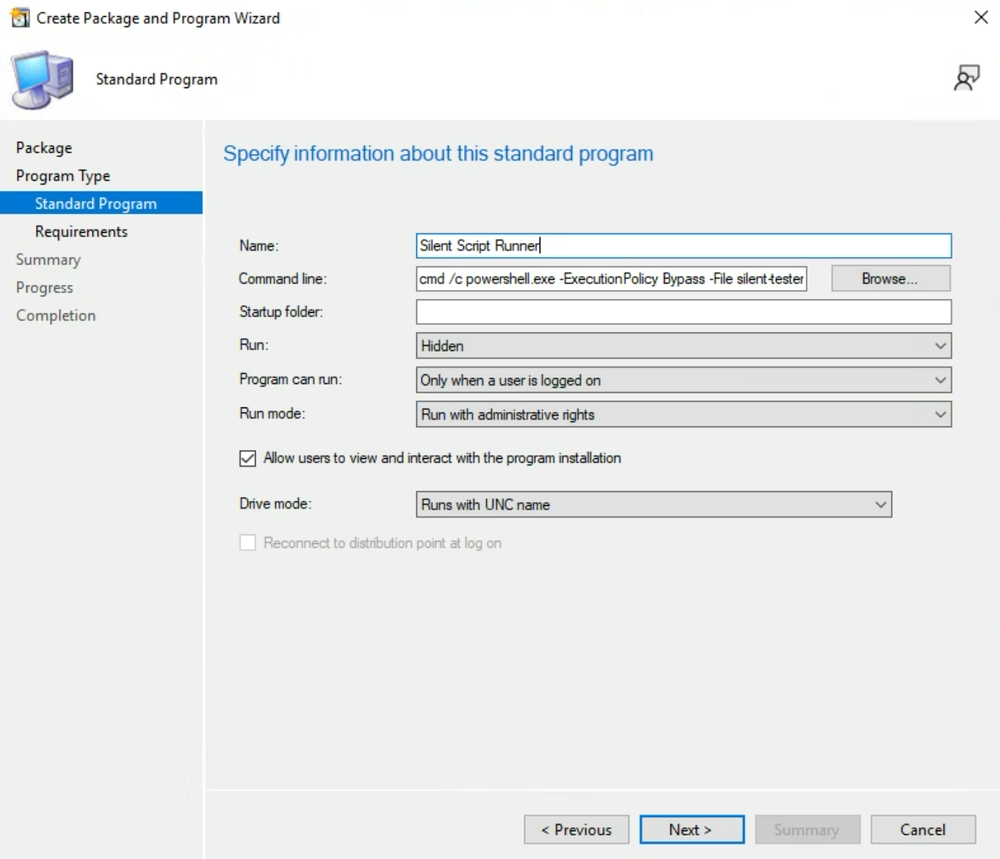
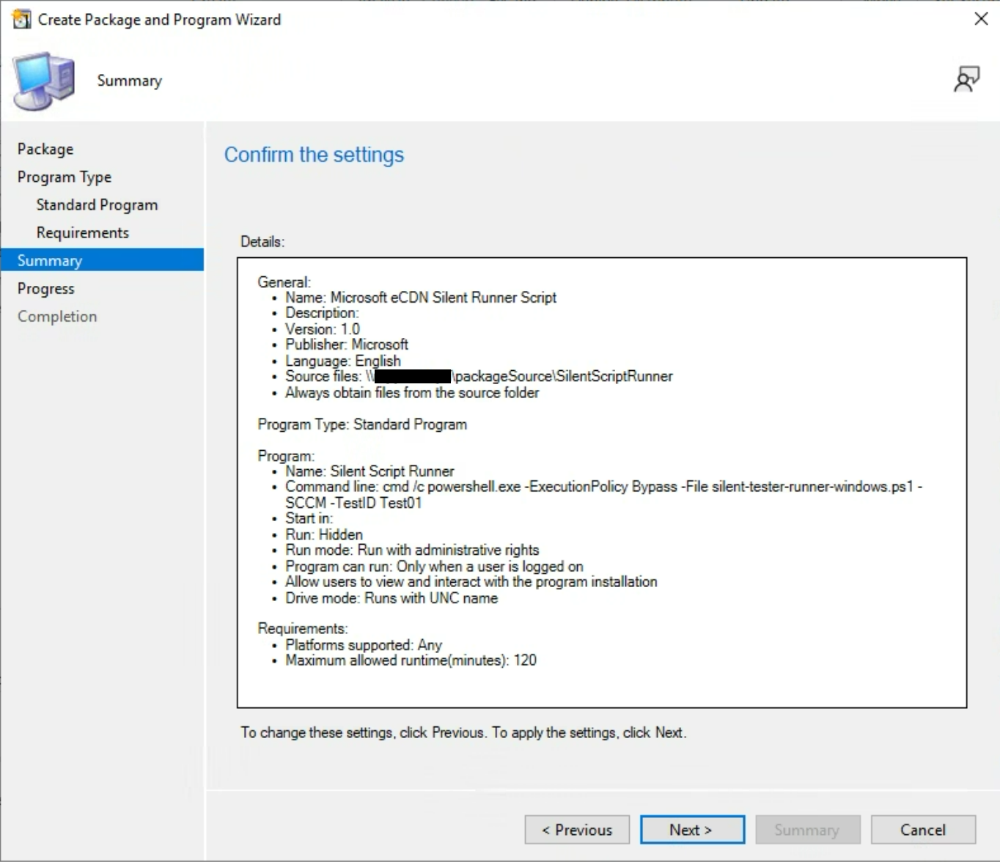
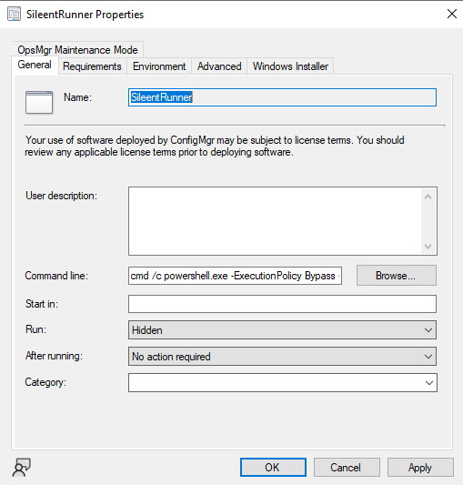
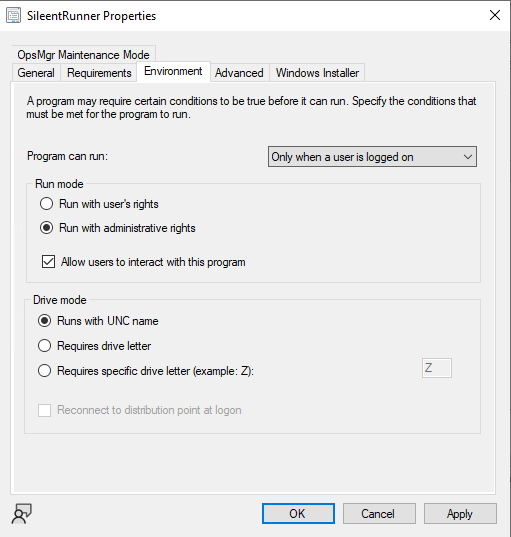

# How to Deploy the eCDN Silent Runner Script with Microsoft SCCM

__Last Update Date:__ June 2025  
__Created By:__ Diego Reategui  

***

*For more on silent testing,* see [*Microsoft eCDN Silent Testing framework on Microsoft Learn*](https://learn.microsoft.com/ecdn/technical-documentation/silent-testing-framework#appendix-b-integrating-runners-using-headless-browser).

## Goal

To provide guidance on how to facilitate Microsoft eCDN's Silent Testing feature using SCCM.

> [!IMPORTANT]
> This guidance should be followed by your environment's SCCM administrator or someone with appropriate SCCM knowledge and permissions. This documentation assumes familiarity with Microsoft System Center Configuration Manager (SCCM).

> [!CAUTION]
> This guidance has been tested and proven to work but __we cannot guarantee__ it will work in your environment. Please use the following as general guidance.

## Preparation: Configure your runner script

Obtain a copy of the runner script and configure it for your tenant. This version of [*silent-tester-runner-windows.ps1* script](./silent-tester-runner-windows.ps1) has been validated to work with the SCCM guidance provided below.

> [!IMPORTANT]
> When executing, the tenant id must be provided.  It's best practice to hard-code your tenant id as the default value of the `$TenantID` parameter.

## Creating the [Configuration Manager package](https://learn.microsoft.com/mem/configmgr/apps/deploy-use/packages-and-programs) for Silent Runner

> [!NOTE]
> Customers should use the Package/Program delivery model instead of Applications due to the silent runner script not providing detection methods.

### 1. Launch the Configuration Manager console and navigate to __Software Library__ pane, then to __Application Management__. You will then select __Packages__

### 2. Select the __Create Package__ option

### 3. In the *Create Package and Program* wizard, configure the Package for your environment

a.  On the __Package__ page, configure the __Name__ and __Source folder__. The *Source folder* should contain the *silent-tester-runner-windows.ps1* script. The other fields are optional.

b.  On the __Program Type__ page, select the __Standard__ program type for computers.

c.  On the __Standard Program__ page, specify the following information.

- Provide a __Name__
- __Command Line__:\
    `cmd /c powershell.exe -ExecutionPolicy Bypass -File silent-tester-runner-windows.ps1 -SCCM`
    > TIP: Optionally, specifically just for troubleshooting, you may use `-AdapterId` parameter with a customized argument such as `%COMPUTERNAME%` which will reflect in the Silent Testing management console.
- __Run__: Hidden
- __Program can run__: Only when a user is logged on.
- __Run mode__: Can run with either user or administrative rights.\
       Also select the __Allow users to view and interact with the program installation__ checkbox.

d.  On the __Requirements page__, proceed with defaults or configure per your environment.

> NOTE: Configuration Manager cannot track packages running for more than 12 hours so it may present a "run time exceeded" failure for the deployment, which is an expected behavior and does not impact the runner script execution on the client side. Due to the long-running nature of the script, if it's been modified to run for less than 12 hours, we recommend setting the __Maximum allowed run time (minutes)__ to "Unknown".*

e.  On the __Summary__ page, review and click *Next* to finish. Then click *Close* on the __Completion__ page.

When completed, you should have something that looks like this.

### 4. Select the newly created Package and Distribute Content, proceed through the wizard as per customer environment

### 5. If necessary, [create a collection](https://learn.microsoft.com/mem/configmgr/core/clients/manage/collections/create-collections) of machines for deploying the silent runner script

### 6. Deploy the Package to the target collection

### 7. After targeted systems receive and process the Package deployment, the silent runners should be ready for headless testing via the [Microsoft eCDN Silent Testing dashboard](https://aka.ms/ecdn/admin/silent-tester)

For more, refer to the [How to Perform a silent test](https://learn.microsoft.com/ecdn/how-to/perform-silent-test) documentation on Microsoft Learn.

> [!NOTE]
> If you wish to re-run the runner script, update test id within the script in the source folder, then update package distribution points. You can now deploy this package to a collection of machines.
